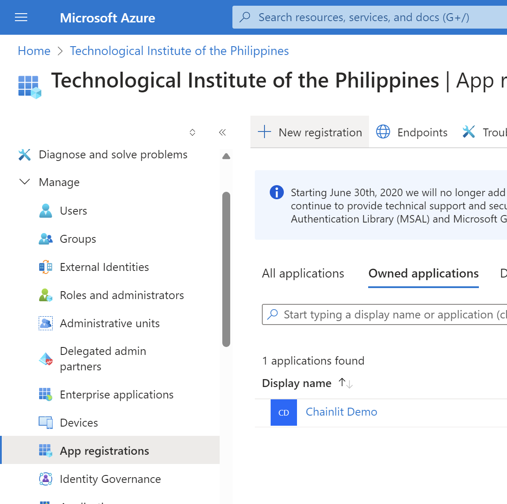
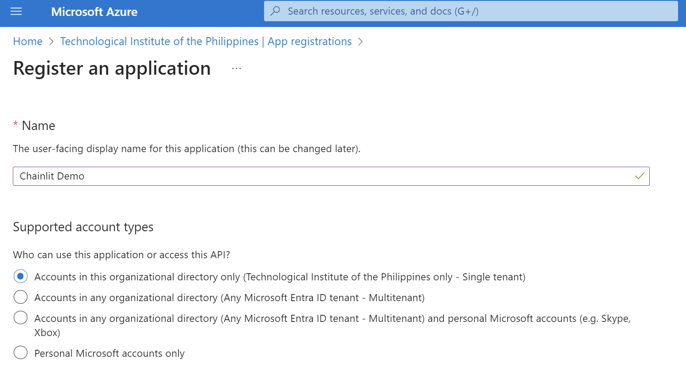
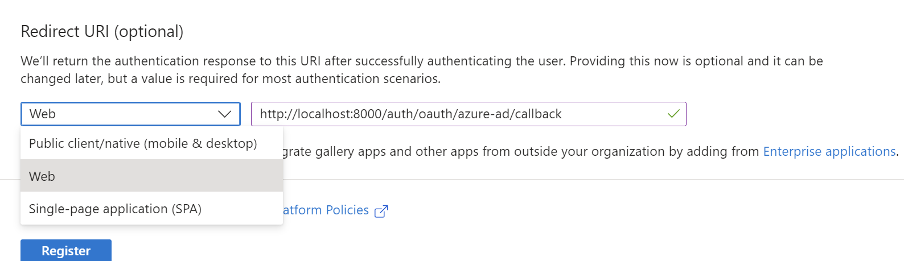
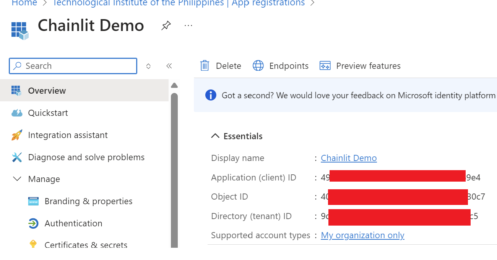
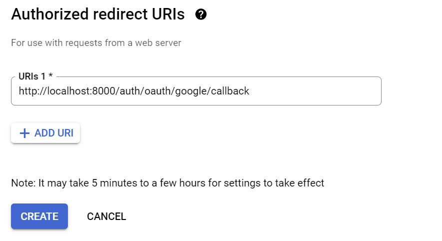
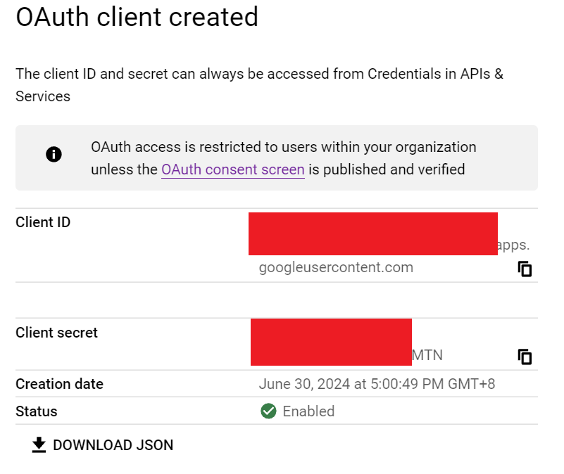
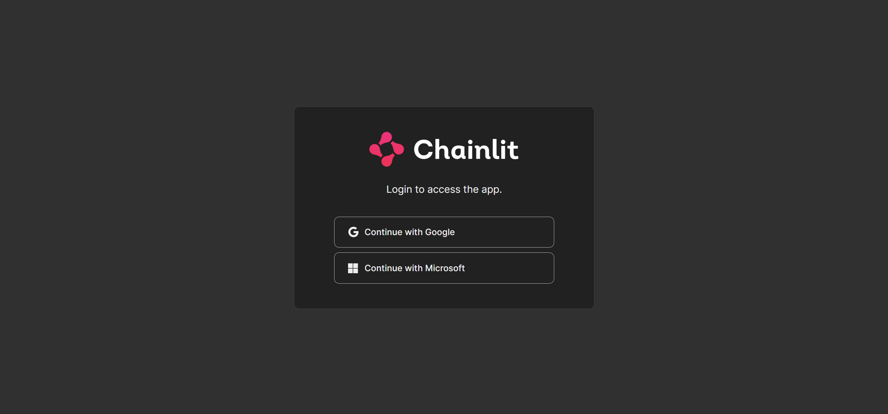

## Installation

Open a terminal and run:

```bash
$ pip install chainlit
```

Run application

```
$ chainlit run demo.py -w
```

## Add OAuth
### Microsoft (Azure Entra ID / Azure Active Directory)
1. Navigate to Azure Entra ID in Azure Portal. Make sure you opened the appropriate tenant. In this case, let's use Technological Institue of the Philippines as the tenant.
2. Navigate to Manage > App Registrations.
3. Click New Registration

4. Fill out the details for application registration. Use single tenant to only allow users from the organization (e.g. TIP)

5. Additionally, set the redirect URI to `http://localhost:8000/auth/oauth/azure-ad/callback` and the type to `Web`.

6. After registration, take note of the `Application (client) ID` and the `Directory (tenant) ID`. This will be used for the environment variables required to support authentication using Microsoft.

7. Navigate to Manage > Certificates & Secrets (while in your app registration), and create a new client secret. Give it a description and expiration. This will be used as an environment variable as well.
8. Finally, create a `.env` file for and add the following environment variables:
```
OAUTH_AZURE_AD_CLIENT_ID=your client id
OAUTH_AZURE_AD_CLIENT_SECRET=your client secrent
OAUTH_AZURE_AD_TENANT_ID=your tenant id
OAUTH_AZURE_AD_ENABLE_SINGLE_TENANT=true
```

### Google Cloud Platform
1. Navigate to https://console.developers.google.com/apis/credentials to create credentials for OAuth.
2. Click on Create Credentials > OAuth Client ID.
3. Select Web Application as the application type.
4. Add `http://localhost:8000/auth/oauth/google/callback` as an Authorized redirect URI and click create:

5. After creating your credentials, take note of the `Client ID` and `Client Secret` to be used for the environment variables to enable Google login.

6. Don't forget to setup your OAuth consent screen. Just follow the steps.
7. Finally, add the following to your environment variables:
```
OAUTH_GOOGLE_CLIENT_ID=your client id
OAUTH_GOOGLE_CLIENT_SECRET=your client secret
```
Result
